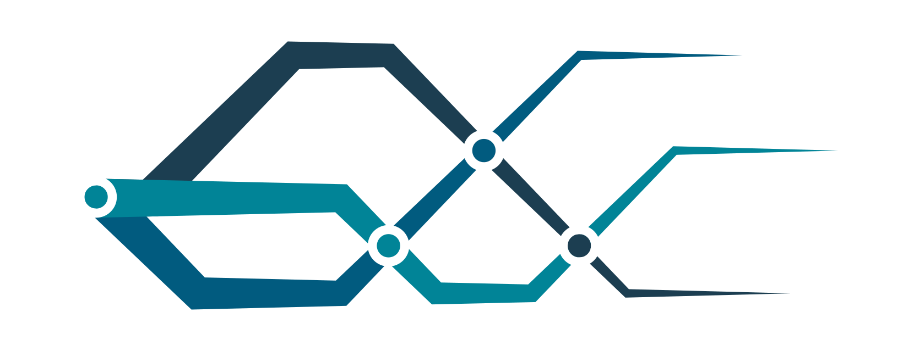

<!--
Copyright The MF-Plugin Contributors

Licensed under the MIT License.
For details on the licensing terms, see the LICENSE file.
SPDX-License-Identifier: MIT
-->

<div align="center">
  
Material Flow Plugin for the PFDL
===========================


<br><br>

**DISCLAIMER**:
This project is not intended for everyday use and made available without any support.
However, we welcome any kind of feedback via the issue tracker or by e-mail.
</div>

---

The **M**aterial **F**low (MF)-Plugin is a plugin for the [Production Flow Description Language (PFDL)](https://github.com/iml130/pfdl) Domain Specific Language. It enables the user to describe advanced transportation tasks included in a material flow. Such a material flow consists of 1..N transport orders. A transport order represents an operation of a pickup of a good at location A and a delivery of the good at a dedicated location B. In general, a transport order can be executed by a human, by an _automated guided vehicle (AGV)_, an _autonomous mobile robot (AMR)_, or in collaborative mode. In the following, the executor/executing entity will be addressed in general with _mobile robot (MR)_.

This repository contains the grammar specification for the MF-Plugin and provides an own scheduler that supports the extended syntax. The grammar is realized with the help of [ANTLR](https://www.antlr.org/).

# Table of Contents

- [MF-Plugin grammar extension](#mf-plugin-grammar-extension)
  - [More flexible Structs](#more-flexible-structs)
  - [Intralogistic primitives](#intralogistic-primitives)
  - [Additional Task options](#additional-task-options)
  - [Orders](#orders)
  - [Ordersteps](#ordersteps)
  - [Rules](#rules)
  - [Modules](#modules)
- [Installation](#installation)
- [Generate ANTLR files from the grammar](#generate-antlr-files-from-the-grammar)
- [Unit and Integrationtests](#unit-and-integrationtests)
- [Release Notes](#release-notes)
- [License](#license)

## MF-Plugin grammar extension

The MF-Plugin extends the PFDL to enable the definition of transports in a declarative way. It contains

- [New predefined _Structs_ to describe Intralogistic primitives](#intralogistic-primitives)
- [Additional Options to describe a _Task_](#additional-task-options)
- [_Orders_](#orders) and [_Ordersteps_](#ordersteps) to describe Transports
- [_Rules_](#rules) to express complex logic in _Tasks_ or _OrderSteps_

All of the additionally defined grammar contained in the MF-Plugin can be used aside the grammar and functionalitites the PFDL defines. Therefore, the MF-Plugin comes with an own Scheduler, which expands the PFDL Scheduler by adding some new functionalities and editing/overwriting some others. A `mainTask` is always required to contain the main program (like the `productionTask` for pure PFDL programs).

### Intralogistic Primitives

The MF-Plugin contains of predefined structs describing intralogistic primitives, that are essential in the domain of intralogistics. Currently three primitves exist in the context of the MF-Plugin:

- [Location](#location)
- [Event](#event)
- [Time](#time)

Note that each created Struct in the context of the MF-Plugin will automatically have an `id` and `time` parameter assigned that can be accessed, e.g., for comparisons. Therefore each Struct will have the following structure:

```
Struct <Struct name>
    id: string
    time: number
    <additional attribute definitions>
End
```

For simplicity, the two base attributes are not shown in the following _Struct_ definitions and can be left out when defining own _Struct_ definitions.

#### Location

A transport is a movement of goods placed in a container (or bin) from one location to another location. In the MF-Plugin, a _Location_ is defined as follows:

```
Struct Location
    type: ""
End
```

Inside a program using the MF-PLugin syntax, an instance of _Location_ can directly be used without declaring the _Struct_ manually. See an example below. Note that the field `id` is not required and will be set automatically if no value is passed (as `time` as well).

```
Location goodsPallet
    id: "productionArea_palletPlace"
    type: "pallet"
End

Location warehousePos1
    id: "warehouseArea_pos1"
    type: "pallet"
End
```

Figure 1 illustrates this Scenario.

<figure >
    
  <figcaption><b>Figure 1:</b> Production hall with two <i>Locations</i>.</figcaption>
</figure>

#### Event

Sometimes it is necessary to determine the flow control, for example, when an action depends on an interaction with an user or a physical sensor.
The primitive _Struct_ _Event_ is introduced to represent those dependencies, which is defined as follows:

```
Struct Event
    value: boolean | number | string
End
```

The `value` represents the event status and can be either a boolean, a number or a string. See an example of an _Event_ `manualLoadingConfirmation` below. The _Event_'s `value` here might be set to `true` after a button was pressed to confirm that a mobile robot has been loaded.

```
Event manualLoadingConfirmation
    id : "buttonMRIsLoaded"
    value : false
End
```

#### Time

The primitive _Time_ is linked to the UNIX [cron job](https://en.wikipedia.org/wiki/Cron) time. This primitive enables the scheduling of a Task in the future.

```
Struct Time
    timing: string # Unix crontab Format
    value: bool # is set to true if the time in timing was reached
End
```

A _Task_'s time of execution can, for example, be set to 6:30am by creating a _Time_ instance like `startOfProduction` in the example below and passing it to the _Task_. The `value` of `startOfProduction` will be set to `true` when the wanted timestamp is reached.

```
Time startOfProduction
    timing: "30 6 * * *"
    value: false
End
```

### Additional Task options

With the MF-Plugin, the _Task_ functionality is expanded. Beneath _Tasks_ and _Services_, any number of _Order_ statements can be called from inside a _Task_. With the help of _Orders_, a Task in the MF-Plugin is able to describe that an item should be picked up at some location and be delivered to another location.

The example below builds upon the two _Locations_ which were defined through `goodsPallet` and `warehousePos1`. To transport a good from `goodsPallet` to `warehousePos1`, two [_TransportOrderSteps_](#transportorderstep), which define the corresponding location, are needed. Each _TransportOrderStep_ is then included in the _Task_’s _Transport_ statement. See Figure 2 for an illustration of the MF-Plugin code.

```
TransportOrderStep loadGoodsPallet
    Location: goodsPallet
End

TransportOrderStep unloadGoodsPallet
    Location: warehousePos1
End

Task transportGoodsPallet
    Transport
    From    loadGoodsPallet
    To      unloadGoodsPallet
End
```

<figure>
    
  <figcaption><b>Figure 2:</b> A simple <i>Transport</i> with one pickup location. </figcaption>
</figure>

There are also some additional options that can be defined once in a _Task_. These statements are:

- _StartedBy_
- _FinishedBy_
- _Constraints_

The _StartedBy_ and _FinishedBy_ statements are able to restrict the start or finish of a _Task_, respectively, depending on a passed condition. This could either be the truth value of a [_Time_](#time) instance or an expression that might be realized by a [_Rule_](#rules). Note that the `mainTask` ignores these statements because it is meant to be wrapped around the whole program.

See an example of a Task `taskWithEvent` that contains a _StartedBy_ statement that is linked to the _Event_ `manualLoadingConfirmation`described [here](#event). The _Task_ is started after the condition was met, which happens by pressing the button connected to the _Event_. An illustration of this logic can be found in Figure 3.

```
Task taskWithEvent
    StartedBy manualLoadingConfirmation.value

    Transport
    From loadGoodsPallet
    To unloadGoodsPallet
End
```

<figure>
    
  <figcaption><b>Figure 3:</b> A transportation <i>Task</i> that is started when a specific <i>Event</i> is triggered. </figcaption>
</figure>

Transports that need to fulfill certain constraints can be defined with the help of the _Constraint_ keyword. In the following example, a time span is defined using the JSON inline syntax. Here the transport should take place in the period from 14:05 to 14:45pm. This restriction is taken into account during the order assignment, either by the process itself, or by the MRs that apply for the order.

```
Task transportGoodsPallet
    Transport
    From        loadGoodsPallet
    To          unloadGoodsPallet

    Constraints: {"TransportStart" : "05 14 * * *", "TransportFinished" : "45 14 * * *"}
End

```

### Orders

In the simplest form, a _Task_ in the MF-Plugin describes that an item should be picked up at some location and be delivered to another location. Furthermore, actions can be executed at specified locations. There are three additional operations available in a _Task_ to tell a mobile robot what to do: _Transport_, _Move_ and _Action_.

A Transport Order (indicated by the _Transport_ keyword) is made up of at least two _TransportOrderSteps_. A _TransportOrderStep_ inherently consists of a Move Order or an Action Order or both. A Move Order is defined as the movement from the current location to a specific destination. An Action Order is defined as an action of manual or automatic loading or unloading of a mobile robot.

To allow more flexibility, besides the _Transport_, there also exist a _Move_ and _Action_ statement, representing the Move and Action Order. However, these statements can only appear in a _Task_ after a _Transport_ was executed. Otherwise, for example with only an Action Order in a _Task_, it would make no sense that a random MR executes an action, as this _Action_ in general depends on a specific _Location_, which might not be similar to the MR's location. Instead, each _Transport_, _Action_ or _Move_ included in a _Task_ is meant to be executed by the same mobile robot.
To provide coherence, a _MoveOrderStep_ and _ActionOrderStep_ is included, which works like the _TransportOrderStep_.

#### Transport Order

A Transport Order is indicated by the _Transport_ keyword and consists of at least one _TransportOrderStep_ describing the pickup _Location_ and exactly one _TransportOrderStep_ for the delivery _Location_. Additional options are also possible for one _TransportOrderStep_, as explained [here](#transportorderstep). For the pickup indicated by the _From_ keyword, multiple _TransportOrderSteps_ are also possible. The syntax looks like the following:

```
Transport
From        {transportOrderStepPickup1, ..., transportOrderStepPickupN}
To          {transportOrderStepDelivery}
```

See an example of a _Task_ `transportGoodsPallet` describing a Transport Order containing two pickup _TransportOrderSteps_ below:

```
Location goodsPallet2
    id: "productionArea_palletPlace"
    type: "pallet"
End

TransportOrderStep loadGoodsPallet
    Location: goodsPallet
End

TransportOrderStep loadgoodsPallet2
    Location: goodsPallet2
End

TransportOrderStep unloadGoodsPallet
    Location: warehousePos1
End

Task transportGoodsPallet
    Transport
    From    loadGoodsPallet, loadgoodsPallet2
    To      unloadGoodsPallet
End
```

Note, that the order of the pallets inside the _From_ statement is not necessarily the pickup order. The solution of this problem is solved internally, by a so called execution engine. It is only important to define the pickup locations, respectively where the goods should be transported to and not how it is done. In the example scenario shown in Figure 4, `goodsPallet2` is visited before `goodsPallet` by the MR.

<figure >
    
  <figcaption><b>Figure 4:</b> A <i>Transport</i> with two pickup locations. </figcaption>
</figure>

#### Move Order

A Move Order is called by the _Move_ keyword and takes only one [_MoveOrderStep_](#moveorderstep-and-actionorderstep) to set the _Location_ for the mobile robot to drive towards.

```
Move
To {moveOrderStep}
```

As mentioned, a Move Order can only appear in a _Task_ if there was at least one Transport Order (and therefore a MR assigned) before. See an example below. Here, the mobile robot that executes the transport in `transportGoodsPallet` should drive to a specific parking location afterwards. The following program is illustrated in Figure 5.

```
Location parkingPos
    id: "parkingPos_1"
End

MoveOrderStep moveToParkingPos
    Location: parkingPos
End

Task transportGoodsPallet
    Transport
    From        loadGoodsPallet
    To          unloadGoodsPallet

    Move
    To          moveToParkingPos
End
```

<figure >
    
  <figcaption><b>Figure 5:</b> A <i>Transport</i> with an additional <i>Move</i> Order. </figcaption>
</figure>

#### Action Order

An Action Order can be used to specify an _Action_ that the MR should perform at its current position. An [_ActionOrderStep_](#moveorderstep-and-actionorderstep) is necessary for that.

```
Action
Do {actionOrderStep}
```

As for the Move Order, an Action Order can only appear in a _Task_ if there was at least one Transport Order (and therefore a MR assigned) before. In the example below, the MR is instructed to load a specific pallet at the _Location_ of `unloadGoodsPallet` by using an _Action_ statement.

```
ActionOrderStep loadAdditionalGood
    Parameters: {"load": "pallet2"}
End

Task transportGoodsPallet
    Transport
    From        loadGoodsPallet
    To          unloadGoodsPallet

    Action
    Do          loadAdditionalGood
End
```

### OrderSteps

OrderSteps are used to specify the Order statements _Transport_, _Move_ and _Action_. For each of them, there exists an OrderStep with different options for the specific usecase. Additionally, each OrderStep type can also optionally contain a _StartedBy_ and _FinishedBy_ statement, which work [as for a Task](#additional-task-options). Furthermore, an _OnDone_ statement can be defined once per OrderStep. This statement takes a Task name. The corresponding _Task_ is executed when the OrderStep containing the _OnDone_ statement finishes. With that use, more complex material flows can be realized. Note that the MR that is assigned to a possible followUp _Task_ defined in the _OnDone_ statement does not have to be the same as the one that executes the original _Task_.

#### TransportOrderStep

A _TransportOrderStep_ (TOS) is mainly described by a _Location_ (representation of a Move Order) and optionally the action to be performed there. Here, the optional statement _Parameters_ is used to define or specify the execution of an action. For example, this action could be either loading at a source or unloading at a sink. This corresponds to an Action Order, which is the execution of a specific action at the current position.

```
TransportOrderStep {name}
    # required
    Location: {Instance_Location}

    # optional
    Parameters: {json_object, expression}
    StartedBy: {Rule(...), expression}
    FinishedBy: {Rule(...), expression}
    OnDone: {Task} # follow up task
End
```

The following example _Task_ `transportgoodsPallet2` consists of two _TransportOrderSteps_. The _TransportOrderStep_ `loadGoodsPallet` defines a _Location_ (required) and an optional _FinishedBy_ condition that has to be fullfilled before the _Task_ can be continued. `unloadGoodsPallet` contains an optional _Parameters_ statement to specify the exact pallet where to unload the goods, here the second one.

```
Event mrLoaded
    value: false
End

TransportOrderStep loadGoodsPallet
    Location: goodsPallet
    FinishedBy: mrLoaded.value
End

TransportOrderStep unloadGoodsPallet
    Location: warehousePos1
    Parameters: {"palletNumber" : 2}
End

Task transportgoodsPallet2
    Transport
    From loadGoodsPallet
    To unloadGoodsPallet
End
```

The scenario is depicted in Figure 6.

<figure >
    
  <figcaption><b>Figure 6:</b> A Transport with two <i>TransportOrderSteps</i>, one with a <i>FinishedBy</i> option and one with a <i>Parameters</i> statement to explicitly define the pallet where to unload the goods. </figcaption>
</figure>

#### MoveOrderStep and ActionOrderStep

The _MoveOrderStep_ and _ActionOrderStep_ are defined similarly to the _TransportOrderStep_. The only difference is, that a _MoveOrderStep_ do not contain a _Parameter_ statement and the _ActionOrderStep_ do not contain a _Location_ statement and needs to specify a _Parameter_ statement instead. See the definitions below.

```
MoveOrderStep {name}
    # required
    Location: {Instance_Location}

    # optional
    StartedBy: {Rule(...), expression}
    FinishedBy: {Rule(...), expression}
    OnDone: {Task} # follow up task
End
```

```
ActionOrderStep {name}
    # required
    Parameters: {json_object, expression}

    # optional
    StartedBy: {Rule(...), expression}
    FinishedBy: {Rule(...), expression}
    OnDone: {Task} # follow up task
End
```

### Rules

With the help of _Rules_, the values of instances can be evaluated in a more advanced manner. It enables an event-driven program control with more comprehensive expressions. Within _Rules_, the logical operators for comparisons (<, ≤, ==, !=, ≥, >) and concatenation (AND, OR, NOT(represented by !)), as well as the mathematical basic arithmetic operations (+, -, ∗, /) can be used. Dependencies, sequences or even temporal properties can be realized by using _Rules_. Expressions in _Rules_ are only evaluated, so the values are not changed. If all expressions within a rule evaluate to `true` the value `true` is returned, otherwise this rule is invalid and `false` is returned. Moreover, a _Rule_ call can also consist of other _Rules_.

Parameters or default values can be passed into a _Rule_. The following example has the three parameters `event1`, `event2` and `offset`. The first two parameters have to be passed at runtime while the third, if it is not assigned a value manually, is assigned a default value (here 0).

```
Rule beforeWithOffset(event1, event2, offset = 0)
    (event1.time + offset < event2.time) And (event1.value == 5)
End
```

Note that, if there are several expressions in multiple lines, it is implicitly assumed that all expressions of the _Rule_ are linked with an AND. The _Rule_ `beforeWithOffset2` defined in the following example is equivalent to the previously defined Rule `beforeWithOffset`.

```
Rule beforeWithOffset2(event1, event2, offset = 0)
    event1.time + offset < event2.time
    event1.value == 5
End
```

## Installation

As this plugin is specified to complement the PFDL, the code needs to be inside the [`plugins` directory](https://github.com/iml130/pfdl/pfdl_scheduler/plugins) of the [PFDL Scheduler](https://github.com/iml130/pfdl). The MF-Plugin scheduler can then be accessed via the following commands:

```python3
import pfdl_scheduler.plugins as plugins

mf_plugin_scheduler = plugins.load("mf_plugin.mf_plugin.scheduler", "pfdl_scheduler")
```

You can find a full demonstrator of the MF-Plugin Scheduler [here](mf_plugin_demo.py). Note that this file has to be placed on top of the project structure (of the PFDL repository) in order to work as expected. Please also have a look at the several [example files](examples) that use the MF-Plugin grammar!

### Requirements

All requirements are listed in [requirements.txt](./requirements.txt) and can be installed via `pip install -r requirements.txt`.

## Generate ANTLR files from the grammar

After changing the MF-Plugin grammar, you will need to regenerate the respective generated ANTLR classes (Lexer, Parser, Visitor and Listener) from the grammar specification:

Make sure to first install ANTLR correctly. Follow the guide on the [official ANTLR site](https://www.antlr.org/) to install it.
To generate the Lexer and Parser with an additional visitor as Python classes, run the following command inside the `grammar` directory:

> antlr4 -v 4.9.3 -Dlanguage=Python3 -visitor PFDLLexer.g4 PFDLParser.g4

Now, the generated classes can be used within a Python script. Within the original project structure, it is necessary to move/copy the generated files into the `mf_plugin/parser` directory.

## Unit and Integrationtests

The project uses a pipeline to run different unit and integration tests. If you want to execute the tests locally, run it via VSCode ([Python Extension](https://marketplace.visualstudio.com/items?itemName=ms-python.python)) or via the following command in the projects root directory (in the PFDL directory):

> python3 -m unittest discover -v

This will give a detailed overview over all test results. If you want to run the test isolated use something like the following:

> python3 -m unittest discover -v pfdl_scheduler/plugins/mf_plugin/tests

## License

Material Flow (MF)-Plugin is licensed under the MIT License. See [LICENSE](./LICENSE) for details on the licensing terms.

## Academic Attribution
If you use the MF-Plugin for research, please include the following reference in any resulting publication.

- [Towards a Unified Flow Description Language for CPPSs: An Example with Material Flows](https://doi.org/10.1109/ETFA61755.2024.10710795)
```plain
@INPROCEEDINGS{10710795,
  author={Gödeke, Jana and Horstrup, Maximilian and Detzner, Peter},
  booktitle={2024 IEEE 29th International Conference on Emerging Technologies and Factory Automation (ETFA)}, 
  title={Towards a Unified Flow Description Language for CPPSs: An Example with Material Flows}, 
  year={2024},
  volume={},
  number={},
  pages={1-8},
  keywords={Concurrent computing;Production systems;DSL;Synchronization;Manufacturing automation;Domain specific languages;Convergence;Logistics;Cyber-Physical Production System;Domain-Specific Language},
  doi={10.1109/ETFA61755.2024.10710795}}
```